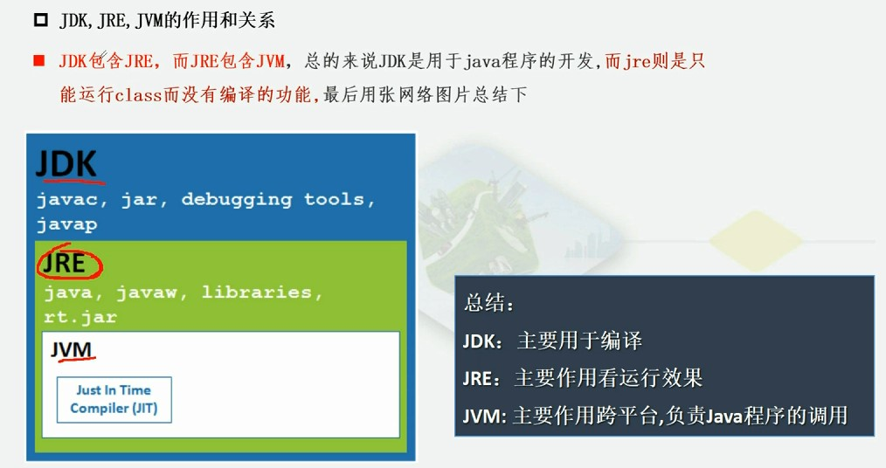

[TOC]

# java开发环境
## 大纲
1. java语言发展史
    * 詹姆斯.高斯林(James Gosling)1977年获得加拿大卡尔加里大学计算机科学学士学位，1983年获得了卡内基梅隆大学计算机科学博士学位，毕业后到IBM工作，设计IBM第一代工作站NeWS系统，但不受重视。后来转至SUN公司，1990年，合作‘绿色计划’，后来发展一套语言'Oak',后来改名为Java
    * SUN(stanford university network,斯坦福大学网络公司)
    * 卡内基梅隆大学截止到2017年，培养出12个图灵奖，20个诺贝尔，9个奥斯卡，114个艾米奖，44个托尼奖
2. Java语言版本
    1. Java是一门软件编程语言，可以编写桌面应用程序，web应用程序，分布式系统，嵌入式系统应用程序
    2. 早期Sun公司对于C++进行了改造，开发了一种称之为Oak的面向都西昂语言
    3. 1995年，Sun公司将Oak更名为java
    4. 1996年，Sun公司发布了Java的第一个开发工具包(JDK 1.0)
    5. 1998年，第二代Java平台的企业版J2EE发布
    6. 1999年，公司发布了第二代Java平台(简称java2)的三个版本
        * j2平台
            * J2ME
                * 应用于移动，无线，有限资源的环境
            * J2SE
                * 应用于桌面环境
            * J2EE
                 * 应用于基于Java的应用服务器
        * java2平台的发布，是Java发展的一个重要的里程碑，标志着Java的应用开始普及
    7. 1998年，发布java 1.2
    8. 2000年，发布java 1.3
    9. 2002年，java 1.4
    10. 2004年 发布java 5，之后的java直接以版本号命名
    11. 2009年，甲骨文宣布收购Sun
    12. 2010年，Java编程语言詹姆斯.高斯林从甲骨文辞职
    13. 2011年，甲骨文举行了全球庆祝活动，然后java7推出
    14. 2014年，甲骨文发布java8
    15. 2017年，甲骨文发布java9
3. Java语言特点%%
    * 简单性
    * 解释性
    * 面向对象
    * 高性能
    * 分布式处理
    * 多线程
    * 健壮性
    * 动态性
    * 安全性
    * 跨平台
    * 移植性
4. Java语言跨平台原理
    * 什么是跨平台
        * 开发的软件在所有操作系统都能够安装运行
    * Java语言跨平台原理
        * 只需要在运行Java应用程序的操作系统上，安装一个Java虚拟机(JVM),由JVM来负责Java程序在该系统中运行
    * write once, run anywhere
5. JRE和JDK的概述
    * 什么是JRE (java runtime environment)
        * JRE包括Java虚拟机和Java程序所需要的核心类库
        * 如果想要运行一个开发好的Java程序，计算机中只需要安装JRE就好
        * 总的来说JRE= JVM + 核心类库
        * 
    * 什么是JDK (java development kit)
        * jdk是提供给开发人员使用的，包含了java的开发工具，也包括jre
        * 所以安装了jdk，就不需要安装jre
        * java的开发工具有，编译工具(javac),打包工具(jar)等
        * Jdk = jre + java的开发工具
        * jdk = jvm + 核心类库 + Java开发工具(javac)
    * 关系图解
        * 
