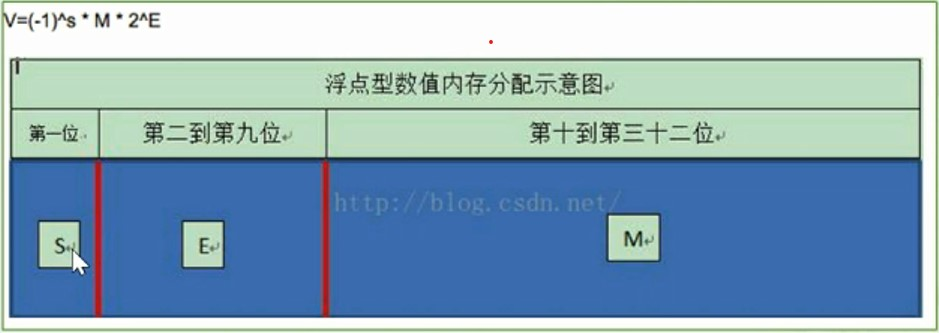

# 类型转换
## 隐式类型转换
1. Java中的默认类型转换规则
    * 取值范围小的数据类型与取值范围大的数据类型进行运算，会先将小的数据类型提升为大的，在进行运算。
    * 例如
    ```
        int x = 3;
        sout(x);      // 3
        byte b = 4;
        x = x + b;    // 相加之后的结果重新赋值给x
        sout(x);      // 7
    ```
    * 例如int类型和byte类型进行运算，会先将byte类型转换为int类型，进行运算，之后在将结果转换为int

## 强制类型转换
* 强制转换有一个安全隐患，会损失精度
```
    int x = 3;
    byte b = 4;
    // b = x + b;     // 会报错，Type mismatch: cannot convert from int to byte
    b = (byte)(x + b); // 强制把int转换为byte
    sout(b)
```
* 强制类型转换损失精度例子
    ```
        int x = 3;
        byte b = 127;
        b = (byte)(x + b);
        // 会直接阶段高位
    ```

## long(8)与float(4)的取值范围谁的大
* float图解
    
* float内存分布分析
    1. float 的宽度分段： 4个字节1位是符号位,8位是指数位，23位是位数位。
    2. 指数是指多少次方，指数位取值位0-255，总共256个数值
    3. IEEE 754规定0表示0，255表示无穷大，还有1-254可用，取值要-127，最后就有-126-127
* 计算
    * float 2 * 2 ^ 127
    * long 2 * 2 ^ 63
* float的计算值的方式与long类型不一样，float = (-1)^s * M * 2 ^ E,E的取值可以取到127，long最大值位2^63-1,float的指数比long大，所以float取值范围要大，所以float的取值范围大于long


## 数据类型相加的细节
* 进行混合运算的时候，byte,short,char不会互相转换，都会自动转换为int类型，byte,short，char与其他类型进行混合运算的是小的数据类型提升为大的。
* 数据类型占用字节大小排序
    1. byte(1), short(2), char(1, 2, 3), int(4)
    2. float(4), double(8)