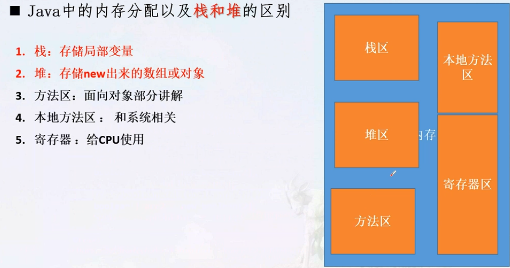
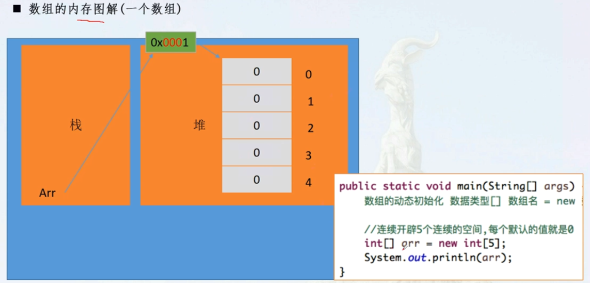
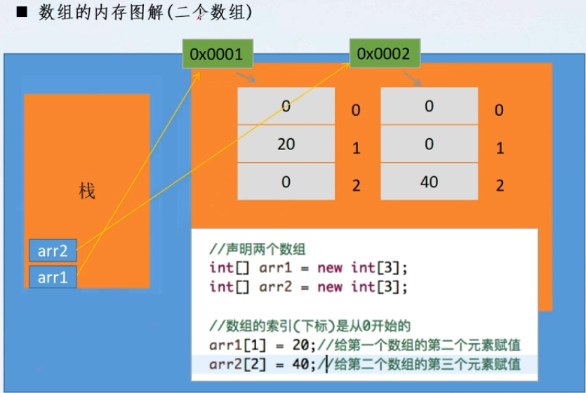

# 数组的内存图解
1. java中的内存分配以及堆栈区别
    * 
2. 数组内存图解
    * 
3. 两个数组图解
    * 

## 数组的静态初始化
1. 数组的动态初始化
    * `int[] arr = new int[3];`
        * 动态初始化，里面的每一个元素分别赋值，只规定了数组的长度
2. 静态初始化的格式
    * 格式： `数据类型[] 数组名 = new 数组类型[] {元素1， 元素2， 元素3};`
    * 简化格式： `数组类型[] 数组名 = {元素1， 元素2， ...};`
        * 注意一般不会在new int[5]写数组个数，不允许动静结合

## 数组操作的两个常见的小问题：越界和空指针
1. 如果声明数组为5个元素，则索引值只能0-5，任何其他的索引取值都会出现   
    * java.lang.ArrayIndexOutOfBoundsException: 错误，这叫数组越界
2. 如果数组赋值为空，则会出现空指针，因为数组已经不存在了
    * java.lang.NullPointerException
