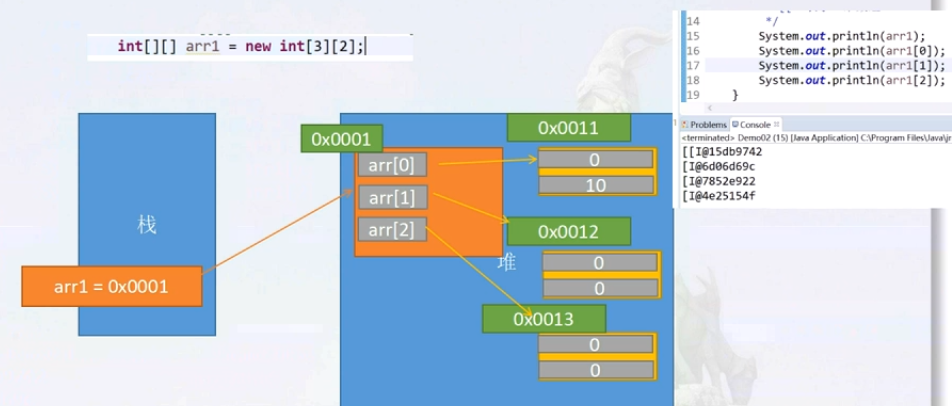

# 二维数组概述和格式
## 二维数组定义
1. 本质上是以数组作为数组元素的数组，即‘数组的数组’
    * 相当于一个箱子里有n个箱子

## 数组格式
1. 数据类型[][] 数组名 = new 数组类型[m][n]   

## 图解内存
* 

## 两种声明方法
* `int [][] arr = new int[3][2];`
    * 声明一个存储3个数组的二维数组，一维数组只能存储2个值。
* `int [][] arr = new int[3][];`
    * 声明一个存储3个数组的二维数组，一维数组只能存几个值不确定。

## 二维数组解释
1. 什么是二维数组，数组里面在存储数组
    * `int [][] arr = {{123, 23, 4}, {34, 43, 53}, {34, 2, 84}};`

2. 二维数组遍历
```
for(int i = 0; i < arr.length;i++){
    for(int j = 0; j < arr[i].length; j++){
        sout(arr[i][j]);
    }
}
```

