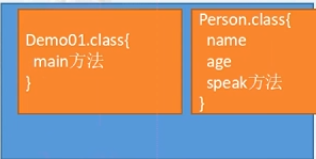

# 面向对象概述
## 思想概述
* 万物皆对象，是计算机中对于世界万物的一种抽象

## 面向过程思想和面向对象思想
1. 面向过程(所有的事情自己做)
    1. 下班接小孩
    2. 做饭
    3. 洗碗
    4. 洗衣服
    5. 晾衣服
2. 面向对象(找擅长的人来做)
    * 保姆(接孩子，做饭，洗碗。。)

## 面向对象思想特点
1. 是一种更加符合我们思想习惯的思想，将复杂的问题简单化
2. 使得我们的角色发生了转变，将我们从问题的执行者变成了指挥者

## 面向对象特征
1. 封装
2. 集成
3. 多态

## 面向对象的思想涉及的词汇
1. 面向对象的分析(OOA)
2. 面向对象的设计(OOD)
3. 面向对象的编程(OOP)

* 面向对象开发或者说面向对象编程的本质就是不断创建对象，使用对象，只会对象做事，管理和维护对象间的关系

## 面向对象的基本概念
* 对象就是值人么要进行研究的世界上的任何事物，从最简单的整数到复杂的飞机均可看作对象，它不仅能表示具体的事物，还能表示抽象的规划，计划或事件。
* 如何描述显示事件的事情
    * 属性： 就是该事物的描述信息(事物身上的名词)
    * 行为： 就是该事物能够做什么(事物身上的动词)
* java中最基本的单位是类，Java中是用class来描述一件事物
    * 类中由成员变量，就是事物的属性
    * 类中由成员方法，就是事物的行为

## 类和对象的概念
* 类： 是一组相关的属性和行为的集合
* 对象： 是该类事物的具体体现

## 类，属性，方法 的声明
* 类的声明 `class 关键字   class Student{}`
* 属性的声明 `数据类型 属性名 String name;`
* 方法声明 `public 返回值 方法名(){}`
* 学生类的定义
    ```
    class Student{
        String name;
        int age;
        char gender;
    }
    ```
## 使用类
1. 创建对象  `[类名 变量名 = new 类名()]`
2. 点语法操作 `对象.属性方法`
3. 指挥对象做事

## java语言的垃圾回收机制
* Java会自动回收无用对象占用的内存空间，是该空间可被程序再次使用

## 创建一个对象
1. 
2. 
3. 

## 注意
1. 在同一个文件中，不能由2个public访问权限的类
2. 同一个包内，不能由两个同名的类
