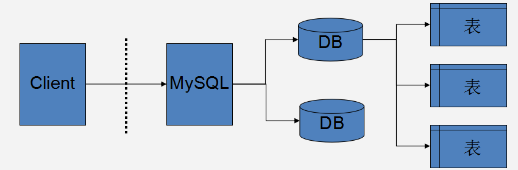

# MySql
## 数据库概述
* 数据库（DataBase，DB）：指长期保存在计算机的存储设备上，按照一定规则组织起来，可以被各种用户或应用共享的数据集合。(文件系统)
* 数据库管理系统（DataBase Management System，DBMS）：指一种操作和管理数据库的大型软件，用于建立、使用和维护数据库，对数据库进行统一管理和控制，以保证数据库的安全性和完整性。用户通过数据库管理系统访问数据库中的数据。
* 数据库软件应该为数据库管理系统，数据库是通过数据库管理系统创建和操作的。
* 数据库：存储、维护和管理数据的集合。

## 常见的数据库
1. Oracle
    * 目前比较成功的关系型数据库管理系统。运行稳定、功能齐全、性能超群、技术领先。主要应用在大型的企业数据库领域，收费，有免费开发版。
2. DB2
    * IBM的产品。
3. SQL Server
    * Microsoft的产品。软件界面友好、易学易用，在操作性和交互性方面独树一帜，跟.net c#。
4. PostgreSQL
    * 加州大学伯克利分校以教学目的开发的数据库系统，支持关系和面向对象的数据库，属于自由数据库管理系统。
5. MySQL
    * 免费的数据库系统。被广泛用于中小型应用系统。体积小、速度快、总体拥有成本低，开放源代码。2008年被SUN收购，2009年SUN被Oracle收购。

## 数据库服务器，数据库和表的关系
* 图解
    * 
* 说明
    * 所谓安装数据库服务器，只是在机器上装了一个数据库管理程序，这个管理程序可以管理多个数据库，一般开发人员会针对每一个应用创建一个数据库。
    * 为保存应用中实体的数据，一般会在数据库创建多个表，以保存程序中实体的数据。

## MySql 登陆，
1. 首先保证在环境变量里面有mysql的MySQL Server的bin目录
2. 输入mysql -u root -p 然后输入密码
3. 查询已经存在的数据库
    * show databases;
4. exit 退出

## MySQL 服务的停止与开启
* 在服务中找到MySQL，可在运行中输入services.msc
* 启动mysql
* 修改root用户的密码
    * 使用mysqladmin命令
        * mysqladmin -u root -p 旧密码 password 新密码
        * 
