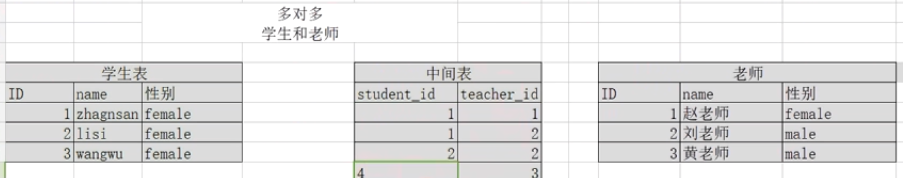

# 数据的完整性
* 作用： 保证用户输入的数据保存到数据库中是正确的。
* 确保数据的完整性=在创建表时给表中添加约束

## 完整性的分类
1. 实体的完整性
2. 域的完整性
3. 引用完整性

## 实体完整性
* 实体： 即表中的一行(一条记录)代表一个实体(entity)
* 实体完整性的作用，标识每一行数据不重复
* 约束类型
    * 主键约束(primary key)
        * 特点： 数据唯一[不能 重复]，并且不能为null，一般会给一张表添加一个主键
        * 添加方式
            ```
            CREATE TABLE student(
                id int primary key,
                Name varchar(50)
            )
            ```
            * 联合主键
            ```
            CREATE TABLE student(
            id int,
            name varchar(50),
            primary key(id)
            );
            CREATE TABLE student(
            id int,
            name varchar(50),
            primary key(id，name)
            );
            ```
            ```
            CREATE TABLE student(
            id int,
            name varchar(50)
            );
            ALTER TABLE student
            ADD PRIMARY KEY (id);

            ```
    * 唯一约束(unique)
        ```
        create table hhh(
            id int primary key,
            name varchar(20) unique
        )
        ```
        * 代表该字段不能重复
    * 自动增长列(auto_increment)
        * 给主键添加自动增长的数值，列只能是整数类型，但是如果删除之前增长的序号。后面再添加的时候序号不会重新开始，而是会接着被删除的那一列的序号
        ```
        create TABLE student(
            id int primary key auto_increment,
            name varchar(50)
        );
        ```
## 域完整性
* 域完整性的作用，限制此单元格的数据正确与否
* 域完整性约束
    * 数据类型
    * 非空约束(not null)
        ```
        CREATE TABLE student(
        id int pirmary key,
        name varchar(50) not null,
        sex varchar(10)
        );
        ```

    * 默认值约束(default)  -- 不会把NULL变成默认
        ```
        CREATE TABLE student(
        Id int pirmary key,
        Name varchar(50) not null,
        Sex varchar(10) default ‘female’
        );
        ```
    * Ckeck约束(mysql 不支持), check()
    * 外键约束 FOREIGN KEY
        * 语法
            * `constraint 外键名称 foreign key (外键字段) fererences 表名(主键)`


## 表与表之间的关系
1. 一对一：
    * 例如t_person表和t_card表，即人和身份证。这种情况需要找出主从关系，即谁是主表，谁是从表。人可以没有身份证，但身份证必须要有人才行，所以人是主表，而身份证是从表。设计从表可以有两种方案：
    * 在t_card表中添加外键列（相对t_user表），并且给外键添加唯一约束；
    * 给t_card表的主键添加外键约束（相对t_user表），即t_card表的主键也是外键。
2. 一对多（多对一）：
    * 最为常见的就是一对多！一对多和多对一，这是从哪个角度去看得出来的。t_user和t_section【部门】的关系，从t_user来看就是一对多，而从t_section的角度来看就是多对一！这种情况都是在多方创建外键！
3. 多对多：
    * 例如t_stu和t_teacher表，即一个学生可以有多个老师，而一个老师也可以有多个学生。这种情况通常需要创建中间表来处理多对多关系。例如再创建一张表t_stu_tea表，给出两个外键，一个相对t_stu表的外键，另一个相对t_teacher表的外键。
    * 图例
        * 
    

